# Домашнее задание к занятию "3.5. Файловые системы"
1. Разряженные файлы - файлы в котором последовательности нулевых байт заменены на информацию о количестве этих байт. Считается одним из способов сжатия информации.
2. Нет. Жёсткие ссылки ссылаются на определенный inode. Таких жёстких ссылок может быть несколько, но все они ссылаются на один реальный файл у которого есть владелец и определенные права доступа, следственно все жёсткие ссылки на этот файл будут иметь тогоже владельца и права доступа.
3. Виртуальная машина переконфигурирована:  
   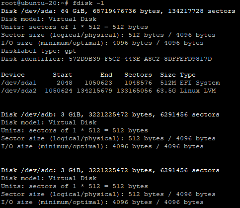
4. Диск /dev/sdb разбит:  
   
5. Таблица разделов перенесена на /dev/sdc:  
   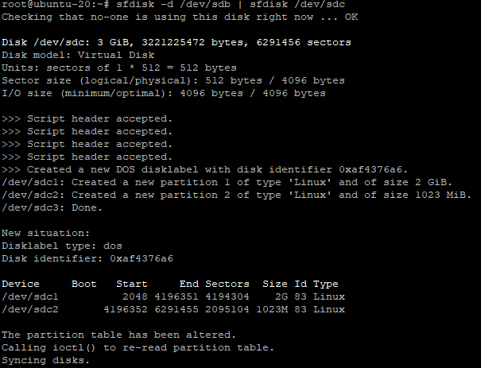
6. RAID 1 собран на /dev/sdb1 и /dev/sdc1:  
   
7. RAID 0 собран на /dev/sdb2 и /dev/sdc2:  
   
8. pv на /dev/md0 и /dev/md1 созданы:  
   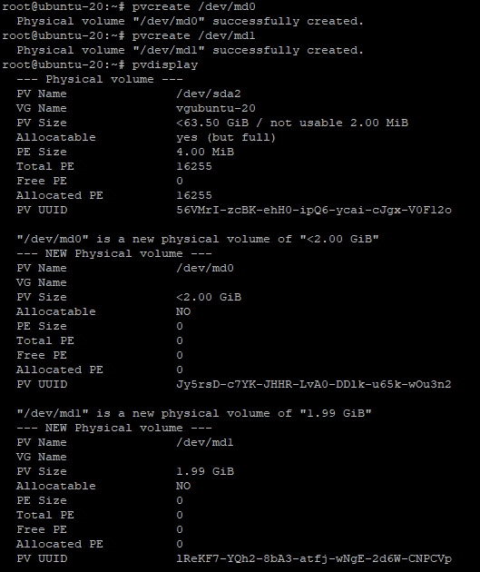
9. Volume group создана:  
   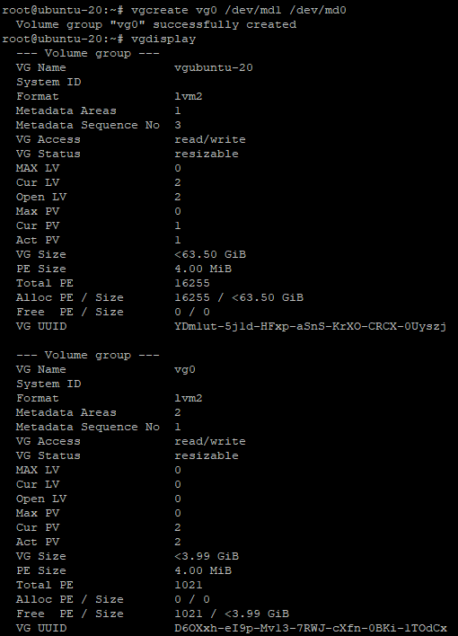
10. LV создан:  
    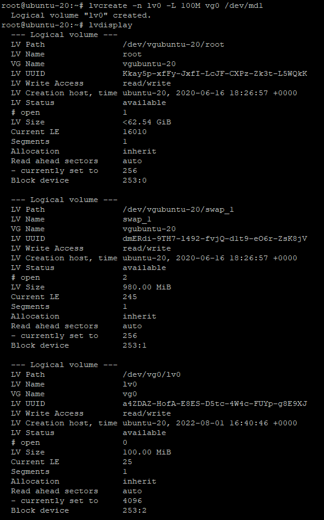
11. Файловая система создана:  
    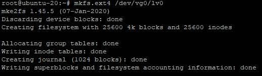
12. Раздел смонтирован:  
    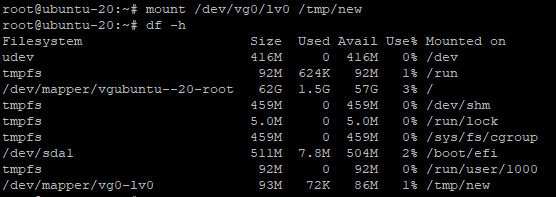
13. Тестовый файл помещен в директорию ```/tmp/new/```:  
    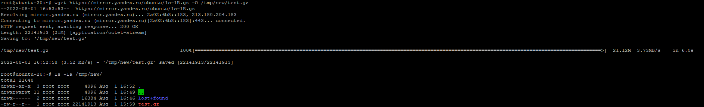
14. Вывод команды ```lsblk```:  
    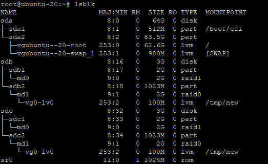
15. Целостность файла протестирована:  
    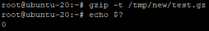
16. Содержимое PV перемещено с RAID0 на RAID1:  
    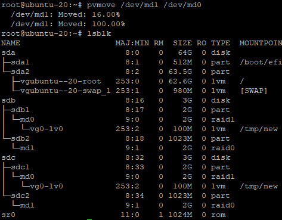
17. Выполнен ```mdadm --fail``` на RAID1:  
    
18. Вывод dmesg, подтверждающий что RAID1 работает в деградированном состоянии:  
    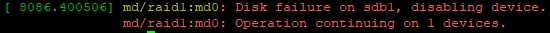
19. Файл по прежнему доступен:  
    
20. Хост уничтожен.